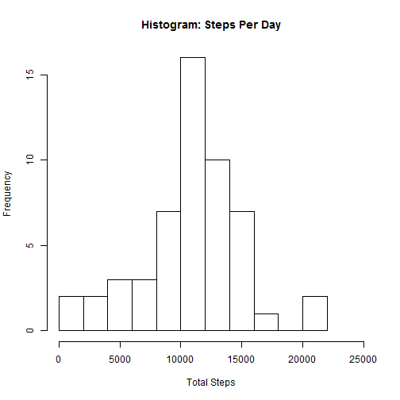
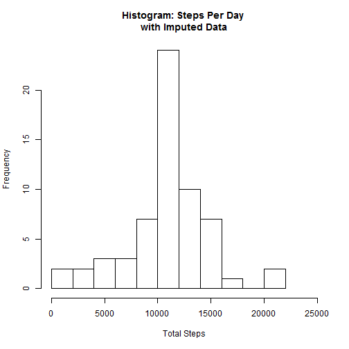
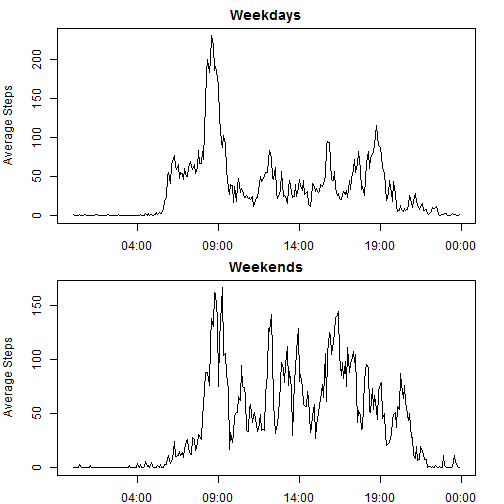

### Reproducible Research: Programming Assignment 1  
Sean Yarborough / July 16, 2016

This document describes the procedure for completing Programming Assignment 1.  
<br>
**Loading and pre-processing the data**


```r
require(dplyr)
activity <- tbl_df(read.csv("activity.csv"))
head(activity)
```

```
## Source: local data frame [6 x 3]
## 
##   steps       date interval
##   (int)     (fctr)    (int)
## 1    NA 2012-10-01        0
## 2    NA 2012-10-01        5
## 3    NA 2012-10-01       10
## 4    NA 2012-10-01       15
## 5    NA 2012-10-01       20
## 6    NA 2012-10-01       25
```
<br>
***What is the mean total number of steps taken per day?***

First, get the total number of steps taken on each day, omitting observations of NA.


```r
activityNoNa <- activity[which(is.na(activity$steps) == FALSE),]
stepsPerDay <- summarize(group_by(activityNoNa, date), sum(steps))
names(stepsPerDay)[2] <- "steps"
head(stepsPerDay)
```

```
## Source: local data frame [6 x 2]
## 
##         date steps
##       (fctr) (int)
## 1 2012-10-02   126
## 2 2012-10-03 11352
## 3 2012-10-04 12116
## 4 2012-10-05 13294
## 5 2012-10-06 15420
## 6 2012-10-07 11015
```

Generate a histogram of total steps per day.


```r
hist(stepsPerDay$steps, breaks = 10, main = "Histogram: Steps Per Day", 
     xlab = "Total Steps", xlim = c(0,25000))
```



Calculate the mean and median.


```r
meanSteps <- as.character(round(mean(stepsPerDay$steps),2))
medianSteps <- as.character(median(stepsPerDay$steps))
```

The mean number of steps taken per day is **10766.19**.  The median number of steps taken per day is **10765**.    
<br>
***What is the average daily activity pattern?***

Get the average number of steps per interval across all days with data.


```r
stepsPerInterval <- summarize(group_by(activityNoNa, interval), mean(steps))
names(stepsPerInterval)[2] <- "steps"
```

Properly format the time interval so that it can be interpreted correctly by padding it out to four digits and using strptime.


```r
i <- 1
for (i in i:length(stepsPerInterval$interval)) {
    if (nchar(stepsPerInterval$interval[i]) == 1) {
        stepsPerInterval$interval[i] <- paste0("000",stepsPerInterval$interval[i])
    } else if (nchar(stepsPerInterval$interval[i]) == 2) {
        stepsPerInterval$interval[i] <- paste0("00",stepsPerInterval$interval[i])
    } else if (nchar(stepsPerInterval$interval[i]) == 3) {
        stepsPerInterval$interval[i] <- paste0("0",stepsPerInterval$interval[i])
    } else {
        stepsPerInterval$interval[i] <- stepsPerInterval$interval[i]
    }
    i <- i + 1
}
stepsPerInterval$fmtInterval <- strptime(stepsPerInterval$interval, format = "%H%M")
```

Now we can create the plot and find the interval with the most steps.


```r
plot(stepsPerInterval$fmtInterval, stepsPerInterval$steps, type = "l", 
     main = "Average Steps per Five-Minute Interval", xlab = "Interval", ylab = "Average Steps")
```


```r
mostStepsInt <- format(as.data.frame(stepsPerInterval[which(
    stepsPerInterval$steps == max(stepsPerInterval$steps)),])[3], "%H:%M")
mostStepsAvg <- as.data.frame(stepsPerInterval[which(
    stepsPerInterval$steps == max(stepsPerInterval$steps)),])[2]
```

The interval containing the most steps, on average, is **08:35**, which has an average of **206.17** steps.

<br>
***Imputing missing values***

Calculate the number of NA values in the original dataset.


```r
sum(is.na(activity$steps) == TRUE)
```

```
## [1] 2304
```

Create a copy of the original dataset and replace the NAs with the interval averages.


```r
activityImputed <- activity
i <- 1
for (i in i:nrow(activityImputed)) {
    if (is.na(activityImputed$steps[i]) == TRUE) {
        activityImputed$steps[i] <- as.integer(stepsPerInterval[which(as.integer(stepsPerInterval$interval) == 
            as.numeric(activityImputed[i,"interval"])), "steps"])
    }
    i <- i + 1
}
```

Confirm that no NA values exist in the new dataset.


```r
sum(is.na(activityImputed$steps) == TRUE)
```

```
## [1] 0
```

Calculate steps per day for the new dataset.


```r
stepsPerDayImputed <- summarize(group_by(activityImputed, date), sum(steps))
names(stepsPerDayImputed)[2] <- "steps"
head(stepsPerDayImputed)
```

```
## Source: local data frame [6 x 2]
## 
##         date steps
##       (fctr) (int)
## 1 2012-10-01 10641
## 2 2012-10-02   126
## 3 2012-10-03 11352
## 4 2012-10-04 12116
## 5 2012-10-05 13294
## 6 2012-10-06 15420
```

Generate a histogram of total steps per day.


```r
hist(stepsPerDayImputed$steps, breaks = 10, main = "Histogram: Steps Per Day \nwith Imputed Data", 
     xlab = "Total Steps", xlim = c(0,25000))
```



Calculate the mean and median.


```r
meanStepsImputed <- as.character(round(mean(stepsPerDayImputed$steps),2))
medianStepsImputed <- as.character(median(stepsPerDayImputed$steps))
```

With the missing data estimated, the mean number of steps taken per day is now **10749.77**.  The median number of steps taken per day is now **10641**.

The change in mean is **16.42** steps.
The change in median is **124** steps.

The imputed data appears to be reducing the mean and median as compared to the original data with the NA values removed.  If it can be assumed that the days for which no data is available are randomly distributed and have no special merit, it *may* suggest that the times during which the device is not being worn or isn't collecting data tend to be periods of lower activity which aren't accounted for in the original dataset, thus inflating the mean number of steps.

<br>
***Are there differences in activity patterns between weekdays and weekends?***

Create a factor variable for weekend and weekday designation.


```r
dayType <- factor(c("weekday","weekend"))
activityImputed$dayOfWeek <- weekdays(as.Date(activityImputed$date, "%Y-%m-%d"))
activityImputed[which(activityImputed$dayOfWeek %in% c("Monday","Tuesday","Wednesday","Thursday","Friday")),
                "dayType"] <- dayType[1]
activityImputed[which(activityImputed$dayOfWeek %in% c("Saturday","Sunday")), "dayType"] <- dayType[2]
```

Before we split the data into weekdays and weekends, let's fix the interval so it displays correctly.


```r
i <- 1
for (i in i:length(activityImputed$interval)) {
    if (nchar(activityImputed$interval[i]) == 1) {
        activityImputed$interval[i] <- paste0("000",activityImputed$interval[i])
    } else if (nchar(activityImputed$interval[i]) == 2) {
        activityImputed$interval[i] <- paste0("00",activityImputed$interval[i])
    } else if (nchar(activityImputed$interval[i]) == 3) {
        activityImputed$interval[i] <- paste0("0",activityImputed$interval[i])
    } else {
        activityImputed$interval[i] <- activityImputed$interval[i]
    }
    i <- i + 1
}
```

Average the steps taken per interval for weekdays and weekends.

*(I wanted to do this with the summarize function in dplyr, but it kept crashing R so I'm using aggregate instead.)*


```r
activityImputed <- split(activityImputed, activityImputed$dayType)
weekdays <- activityImputed$weekday
weekends <- activityImputed$weekend
weekdayIntervalAvg <- aggregate(weekdays$steps, by = list(weekdays$interval), 
        FUN=mean)
names(weekdayIntervalAvg) <- c("Interval","avgSteps")
weekdayIntervalAvg$fmtInterval <- strptime(weekdayIntervalAvg$Interval, format = "%H%M")
weekendIntervalAvg <- aggregate(weekends$steps, by = list(weekends$interval), 
        FUN=mean)
names(weekendIntervalAvg) <- c("Interval","avgSteps")
weekendIntervalAvg$fmtInterval <- strptime(weekendIntervalAvg$Interval, format = "%H%M")
```

Generate the plot.


```r
par(mfrow = c(2,1))
par(mar = c(2,4,2,2))
plot(weekdayIntervalAvg$fmtInterval, weekdayIntervalAvg$avgSteps, type = "l", 
     main = "Weekdays", xlab = "Interval", ylab = "Average Steps")
plot(weekendIntervalAvg$fmtInterval, weekendIntervalAvg$avgSteps, type = "l", 
     main = "Weekends", xlab = "Interval", ylab = "Average Steps")
```




